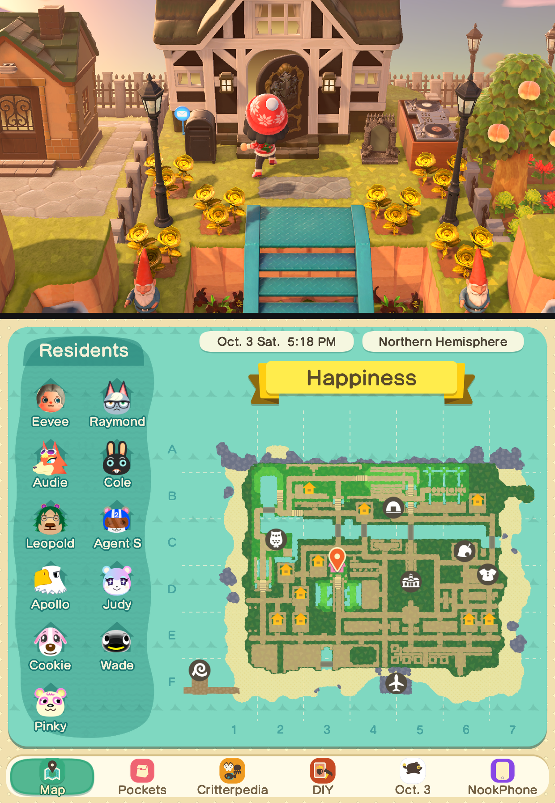
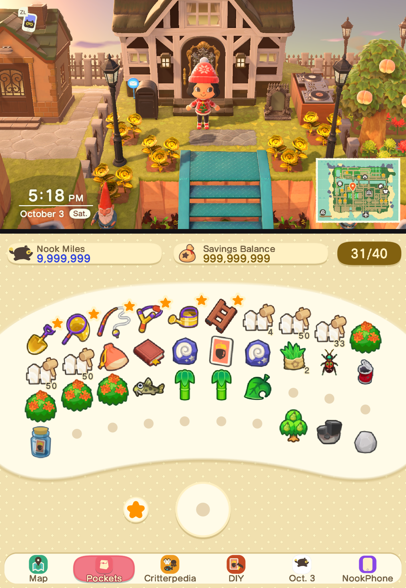
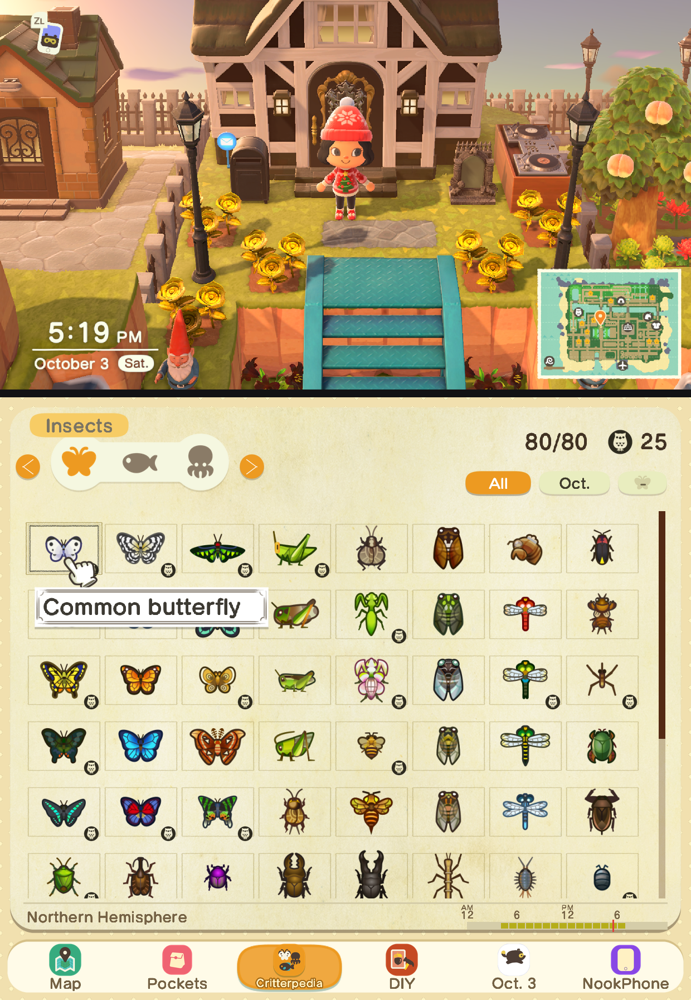
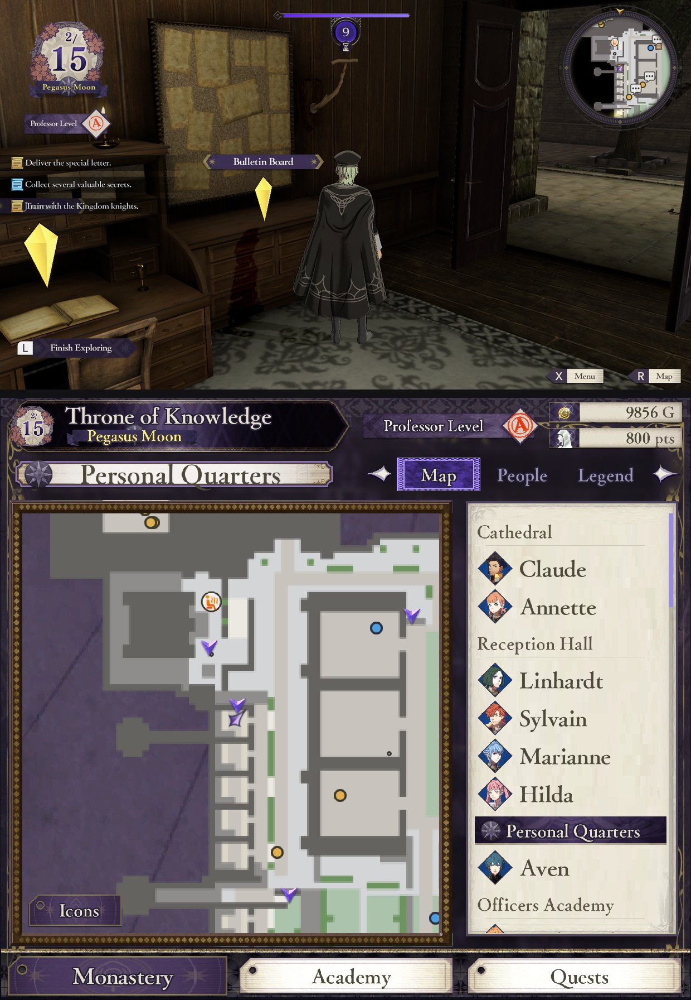
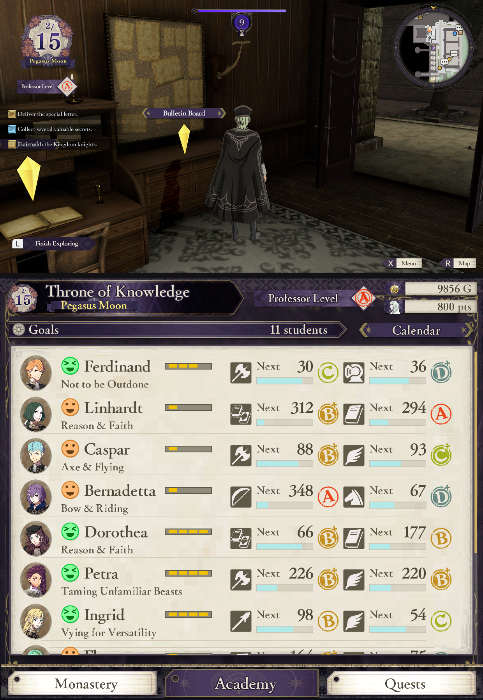
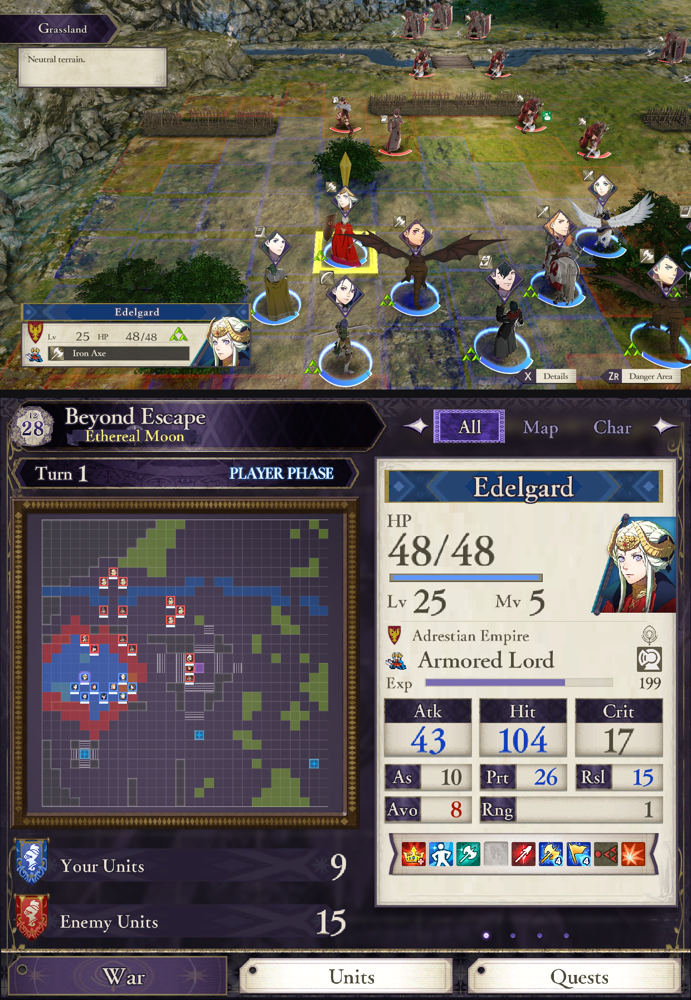
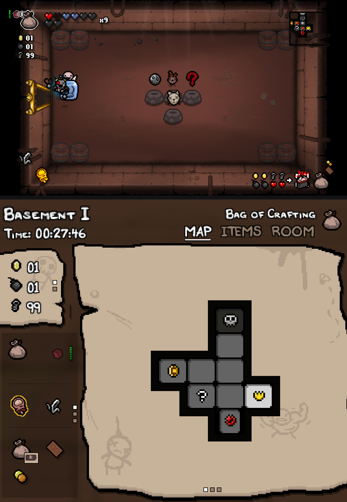
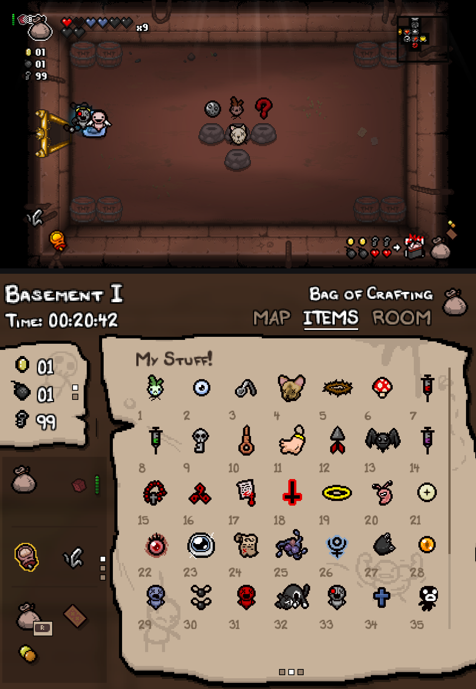
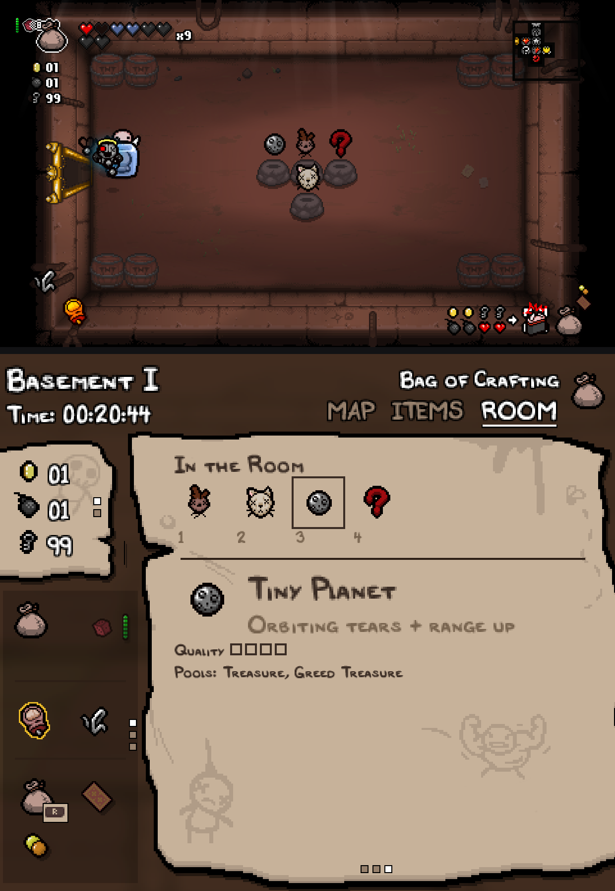

<h1 align="center">Eden Duo Companions</h1>

<p align="center">
  Second-screen companions for <a href="https://github.com/igawa6/eden-duo">Eden Duo</a>, one installable package per game.
</p>

---

A companion turns the second screen of a dual-screen Android handheld into a live, touchable panel for the game you are playing: maps, menus, status and more, read from the running game. Each companion ships as a `.dsmod.zip` package and is installed from the game's **Add-ons** menu in Eden Duo.

This repository holds the companion packages, their documentation and screenshots. The emulator itself lives in [Eden Duo](https://github.com/igawa6/eden-duo).

## Supported Games

The three new companions require Eden Duo 1.1.0 or newer.

| No | Game | Title ID | Patch Version | Companion | Requires<br>(or newer) | Download | Contributor/Supporter |
|---:|------|----------|---------------|-----------|----------|----------|:---------:|
| 1 | [Persona 5 Royal](#persona-5-royal) | `01005CA01580E000` | 1.0.2 | 1.1.0 | Eden Duo 1.0.0 | [.dsmod.zip](https://github.com/igawa6/eden-duo-companions/releases/tag/persona5royal-1.1.0) | 🥇<sup>1</sup> |
| 2 | [Metroid Dread](#metroid-dread) | `010093801237C000` | 2.1.0 | 1.0.0 | Eden Duo 1.0.0 | [.dsmod.zip](https://github.com/igawa6/eden-duo-companions/releases/tag/metroid-dread-1.0.0) | |
| 3 | [The Legend of Zelda: Link's Awakening](#the-legend-of-zelda-links-awakening) | `01006BB00C6F0000` | 1.0.1 | 1.0.0 | Eden Duo 1.0.0 | [.dsmod.zip](https://github.com/igawa6/eden-duo-companions/releases/tag/links-awakening-1.0.0) | |
| 4 | [Mario Kart 8 Deluxe](#mario-kart-8-deluxe) | `0100152000022000` | 4.0.0, 3.0.3 | 1.0.0 | Eden Duo 1.0.1 | [.dsmod.zip](https://github.com/igawa6/eden-duo-companions/releases/tag/mario-kart-8-deluxe-1.0.0) | |
| 5 | [Super Mario Bros. Wonder](#super-mario-bros-wonder) | `010015100B514000` | 1.2.1 | 1.0.1 | Eden Duo 1.0.2 | [.dsmod.zip](https://github.com/igawa6/eden-duo-companions/releases/tag/super-mario-bros-wonder-1.0.1) | ⭐<sup>1</sup> |
| 6 | [Animal Crossing: New Horizons](#animal-crossing-new-horizons) | `01006F8002326000` | 3.0.3 | 1.0.0 | Eden Duo 1.1.0 | [.dsmod.zip](https://github.com/igawa6/eden-duo-companions/releases/tag/animal-crossing-new-horizons-1.0.0) | 🥇<sup>2</sup> |
| 7 | [Fire Emblem: Three Houses](#fire-emblem-three-houses) | `010055D009F78000` | 1.2.0 | 1.0.0 | Eden Duo 1.1.0 | [.dsmod.zip](https://github.com/igawa6/eden-duo-companions/releases/tag/fire-emblem-three-houses-1.0.0) |  |
| 8 | [The Binding of Isaac: Afterbirth+ and Repentance DLC](#the-binding-of-isaac-afterbirth-and-repentance-dlc) | `010021C000B6A000` | 1.7.9b | 1.0.0 | Eden Duo 1.1.0 | [.dsmod.zip](https://github.com/igawa6/eden-duo-companions/releases/tag/the-binding-of-isaac-1.0.0) | 🥇<sup>3</sup> |

<sup>1</sup> 🥇 Thanks to [u/gymgooner123](https://www.reddit.com/user/gymgooner123), who commissioned the Persona 5 Royal companion.

<sup>1</sup> ⭐ Credit to [u/Far_Entrepreneur_246](https://www.reddit.com/user/Far_Entrepreneur_246), creator of Super Mario Wonders companion. Support him on [Patreon](https://www.patreon.com/cw/KalebPowell).

<sup>2</sup> 🥇 Thanks to [MsMeriBerry](https://ko-fi.com/W5J3253HW9), who commissioned the Animal Crossing: New Horizons companion.

<sup>3</sup> 🥇 Thanks to [Armando Chacon](https://ko-fi.com/U3I527XBIL), who commissioned The Binding of Isaac: Afterbirth+ and Repentance DLC companion.

Each companion supports exact game version in **Patch Version**. It checks the running build before it loads. On any other version it does not load and shows a notice, instead of reading memory it does not understand.

## Install

1. Install [Eden Duo](https://github.com/igawa6/eden-duo/releases), at least the version in **Requires**.
2. Update the game to the version in **Patch Version**.
3. Download the game's `.dsmod.zip` from the table above. Do not rename it; the file name carries the title ID, name and version.
4. In Eden Duo, long-press the game, open **Add-ons** and tap **Install**. In the **Content type** dialog choose **Dual screen mods**, tap **OK**, then select the file. It appears in the Add-ons list as, for example, `Persona5RoyalDS-1.0.0`.
5. Launch the game. The companion appears on the second screen once gameplay starts.


Installing a newer version of a companion replaces the older one.

---

## Persona 5 Royal

`01005CA01580E000` · game version 1.0.2 · companion 1.1.0

<!-- screenshots/persona5royal/*.png -->
| Field | Menu | Battle |
|:-----:|:----:|:------:|
|  |  |  |

A full bottom-screen version of the game's own start menu, with live data:

- **Skill, Item, Equip, Persona, Stats, Confidant, Request, Calendar.** Laid out like the native camp menu.
  - Confidants show the character, arcana, rank and rank abilities.
  - Stats include baton pass and down shot.
- **Use items, change equipment and change Persona from the touch screen.** Changes apply instantly by writing the same values the game's own menu writes. Items and skills the game would refuse are greyed out. Anything that is not reproduced exactly, or any request made while the camp menu is already open, is carried out by driving the native menu with button presses.
- **Calendar.** Browse months with L/R and tap any day for its plans. Past days show the game's Daily Log.
- **Battle.** Choose TACTICAL (enemy grid, selected enemy's details and affinities as in Analyze, party status) or FOLLOW, a lighter view that follows the action.
- **Field.** Area map with your position, date, time of day and money.
- **Dialogue.** Only choices are shown, as large buttons; tapping one selects it.
- **Now playing.** The current background music with its title.

The companion ships no game art: menus, fonts and icons are drawn from your own game files when the page first opens.

## Metroid Dread

`010093801237C000` · game version 2.1.0 · companion 1.0.0

<!-- screenshots/metroid-dread/*.png -->
| Map | EMMI zone | Water drain |
|:---:|:---------:|:-----------:|
|  |  |  |

A live area map on the second screen, drawn the way the game draws its own:

- **Area map** with Samus's position, rooms revealed as you explore, doors, items and your custom markers.
- **EMMI zones**: grey while the EMMI is active and green once it has been destroyed, read from the game's own state.
- **Water** as the game's map shows it, including the level moving while a pool drains or fills.
- **Status**: energy and tanks, missiles, power bombs and item collection percentage.

The companion ships no game art: map geometry and icons are built from your own game files.

## The Legend of Zelda: Link's Awakening

`01006BB00C6F0000` · game version 1.0.1 · companion 1.0.0

<!-- screenshots/links-awakening/*.png -->
| Map | Gear | Items |
|:---:|:----:|:-----:|
|  |  |  |

- **Map** of the overworld and dungeons with Link's live position, region names, rupees, seashells and what is on X, Y and B. Dungeon maps show rooms, chests, stairs and the boss room, and switch automatically when you enter a dungeon. Place, change and remove your own map pins.
- **Gear**: the items you can assign, such as magic powder, bombs, arrows, hookshot, rod, boomerang and bottles, with their counts. Equip to X or Y by dragging an item onto a slot, or by tapping the item and then the slot.
- **Items**: sword, shield, tunic, bracelet, boots, flippers and other equipment, the eight instruments, ocarina songs, trading item, heart pieces, secret seashells and secret stones.

The companion ships no game art: it uses your own game files.

## Mario Kart 8 Deluxe

`0100152000022000` · game version 4.0.0 or 3.0.3 (also with CTGP-DX v1.1.1) · companion 1.0.0

<!-- screenshots/mario-kart-8-deluxe/*.png -->
| Map | Horn | Next race |
|:---:|:----:|:---------:|
|  |  |  |

The race screen of the Wii U GamePad, on your second screen:

- **Rank bar.** A glass standings bar with all twelve racers in their live order and the items each one is holding right now. Your row is highlighted, finished racers get the checkered flag, and when racers overtake each other their cards slide into their new places.
- **Horn mode.** A big horn button with your kart's emblem. Tap it and your kart really honks.
- **Map mode.** The course map with every racer's live position, a crown on the leader and a ring around you. The companion starts in map mode.
- **Buttons.** **USE ITEM** fires your item. The other button switches between horn and map.
- **Two row formats and two themes.** Hold the rank bar to switch between short rows (icon and items) and long rows (with names). Hold the horn or the map to switch between the light and the dark theme. Both changes are animated, and taps and holds give haptic feedback.
- **Next race, loading and idle screens** on the game's own loading-screen art, with the course picture, cup and class.
- **CTGP-DX v1.1.1** on game version 3.0.3: custom tracks show their own maps, pictures and names. Install CTGP-DX in Eden Duo as a normal game mod (**Add-ons**, **Install**, **Mods**), next to the companion.
- **Other versions.** On an unsupported game version the companion shows which version it found and which ones it supports, and reads nothing.

The companion ships no game art: icons, maps, emblems, backgrounds, the font and all text are read from your own game files.

Limitations:

- One local player only. Local multiplayer (split screen) is not supported.
- Tested in Grand Prix races. VS races and Time Trials are untested.
- An item that is being used, such as an active Bullet Bill, is not shown in the rank bar.
- CTGP-DX is supported on game version 3.0.3 only, not on 4.0.0.

## Super Mario Bros. Wonder

`010015100B514000` · game version 1.2.1 · companion 1.0.1

<!-- screenshots/super-mario-bros-wonder/*.png -->
| Title | World map | Course |
|:-----:|:---------:|:------:|
|  |  |  |

- **Course.** The world and course name over a blurred picture of the course, and a progress rail from start to goal with your character riding it. The rail marks checkpoints, 10-flower coins, Wonder Seeds and the secret goal as found or missing, and shows how far through the area you are.
- **Status.** The course's 10-flower coins, the world's Wonder Seeds (and how many this run), your current form and the item in your balloon.
- **World map.** The world's name and seeds, the selected course, all nine worlds, and an **Open Courses** button that opens the game's course list.
- **Title screen** art while you choose your save and character.
- Lives, coins and flower coins in the game's own lettering.
- **Other versions.** On any other game version the companion shows a notice and reads nothing.

The companion ships no game art: pictures, icons, the font and course names are read from your own game files.

---

## Animal Crossing: New Horizons

`01006F8002326000` · game version 3.0.3 · companion 1.0.0

<!-- screenshots/animal-crossing-new-horizons/*.png -->
| Island map | Pockets | Critterpedia |
|:----------:|:-------:|:------------:|
|  |  |  |

Your island information and NookPhone pages, always within reach on the second screen:

- **Island map.** Follow your live position, find residents and facilities, and pan and zoom around your island.
- **Pockets.** Browse what you are carrying, with item names and quantities. Touch controls let you select items and equip tools.
- **Critterpedia.** Browse fish, bugs and sea creatures, with collection details and filters.
- **DIY.** Browse recipes by category, see their materials and mark favourites.
- **Today.** A separate page for the day's island information.
- **NookPhone.** Browse the phone's apps and open supported apps through the game's own controls.

The companion ships no game art: maps, item pictures, icons, fonts and text are read from your own game files.

## Fire Emblem: Three Houses

`010055D009F78000` · game version 1.2.0 · companion 1.0.0

<!-- screenshots/fire-emblem-three-houses/*.png -->
| Monastery | Academy | Battle |
|:---------:|:-------:|:------:|
|  |  |  |

Keep the monastery, your students and the battlefield on the second screen:

- **Monastery.** A live map with your position, people and facilities. Pan and zoom, switch between the map, people and legend, and toggle the icons.
- **War.** A tactical map and selected unit details, with combined, map and character layouts.
- **Academy.** Browse the roster and inspect a character's status, items, combat arts, abilities, battalion and skill levels.
- **Calendar.** Open the calendar from the Academy page and select a day.
- **Quests and lost items.** Browse the quest log by status, inspect objectives and rewards, and see the lost items you are carrying.

The companion ships no game art: maps, portraits, icons, fonts and text are read from your own game files.

## The Binding of Isaac: Afterbirth+ and Repentance DLC

`010021C000B6A000` · game version 1.7.9b (Switch update v524288) · companion 1.0.0

<!-- screenshots/the-binding-of-isaac/*.png -->
| Map | Items | Room |
|:---:|:-----:|:----:|
|  |  |  |

A parchment companion for your run, with one package for **Afterbirth+ without DLC** and **Repentance with its DLC installed and enabled**. It selects the edition automatically.

- **MAP.** Follow the live floor map and your current room.
- **ITEMS.** Browse the items collected during the run and tap one to inspect it.
- **ROOM.** See item pedestals in the current room and inspect what is on offer.
- **Counters and stats.** Keep track of your run alongside the main sheet. The lower card cycles between held items, a bag when available, and stats.
- **External Item Descriptions (EID).** Optional descriptions use the selected edition's item data. The switch starts off and remembers your choice. Descriptions are from [External Item Descriptions](https://github.com/wofsauge/External-Item-Descriptions) by wofsauge and contributors.
- **Touch and swipe.** Switch pages, select items and swipe between the side panels, with short transitions and haptic feedback.

The companion ships no game art: parchment, icons, item pictures and fonts are read from your own game files. EID description data is included separately.

The launcher must be updated to 1.7.9b in either edition; unpatched base v0 is not supported.

---

## Contribute to Another Game

Anyone can write a companion for another game, without rebuilding Eden Duo. Start with [**Contribute to Another Game**](docs/CONTRIBUTE.md): what a companion is, what the runtime offers, the reverse-engineering tools, which documents to read in which order, and how to share your companion.

## Building Packages

| Path | Contents |
|------|----------|
| [`packages/`](packages/) | Package sources, one folder per game: `dualscreen/manifest.json`, the per-build data file `<BUILD16>.json` (one per supported build) and, for Persona 5 Royal, the art recipe table `p5r_art.rec`. |
| [`tools/`](tools/) | `build_release.sh` builds all eight `.dsmod.zip` archives from the package sources and separately built native modules. The page generators for Persona 5 Royal ([`tools/p5r/`](tools/p5r/)), Metroid Dread ([`tools/dread/`](tools/dread/)), Mario Kart 8 Deluxe ([`tools/mk8d/`](tools/mk8d/)) and Super Mario Bros. Wonder ([`tools/wonder/`](tools/wonder/)) are here too. |
| [`docs/`](docs/) | How the companion runtime works, the package format, writing a native module and porting a new game. Start with [`docs/CONTRIBUTE.md`](docs/CONTRIBUTE.md). |
| [`screenshots/`](screenshots/) | Captures of both screens for each game. |

The native modules for Persona 5 Royal, Metroid Dread, Mario Kart 8 Deluxe, Super Mario Bros. Wonder, Animal Crossing: New Horizons, Fire Emblem: Three Houses and The Binding of Isaac are C++ and live in the Eden Duo repository under [`src/core/mods/modules`](https://github.com/igawa6/eden-duo/tree/main/src/core/mods/modules). Build them there, strip them, and pass them to the release script:

```sh
P5R_LINUX_SO=... P5R_ANDROID_SO=... DREAD_LINUX_SO=... DREAD_ANDROID_SO=... \
MK8D_LINUX_SO=... MK8D_ANDROID_SO=... WONDER_LINUX_SO=... WONDER_ANDROID_SO=... \
ACNH_LINUX_SO=... ACNH_ANDROID_SO=... FE3H_LINUX_SO=... FE3H_ANDROID_SO=... \
ISAAC_LINUX_SO=... ISAAC_ANDROID_SO=... tools/build_release.sh dist
```

See [`tools/README.md`](tools/README.md) for the details. Link's Awakening needs no native module.

## Reporting Problems

Open an issue and include:

- the game, its version and its title ID;
- the companion version (in **Add-ons**);
- the Eden Duo version;
- the device.

A screenshot of both screens helps.

## Game Assets

Companion packages contain **no game assets**: no art, text, audio or level data. Everything game-specific that a companion shows is read at runtime from the player's own game files and from the running game. Do not upload game files, keys, firmware or ROMs to this repository.

## AI Assistance

These companions were developed with AI assistance. The companion modules, the reverse engineering of each game's data and the package generators were written with an AI coding assistant, then reviewed, tested and verified against each game's own screens.

## License

Companion packages and tools are free software, released under the [GNU General Public License v3.0](LICENSE). They are not affiliated with or endorsed by Nintendo, Atlus, SEGA, the CTGP-DX team, or the Eden project. All trademarks belong to their respective owners.
