<h1 align="center">Eden Duo Companions</h1>

<p align="center">
  Second-screen companions for <a href="https://github.com/igawa6/eden-duo">Eden Duo</a>, one installable package per game.
</p>

---

A companion turns the second screen of a dual-screen Android handheld into a live, touchable panel for the game you are playing: maps, menus, status and more, read from the running game. Each companion ships as a `.dsmod.zip` package and is installed from the game's **Add-ons** menu in Eden Duo.

This repository holds the companion packages, their documentation and screenshots. The emulator itself lives in [Eden Duo](https://github.com/igawa6/eden-duo).

## Supported Games

| No | Game | Title ID | Patch Version | Companion | Requires<br>(or newer) | Download | Contributor/Supporter |
|---:|------|----------|---------------|-----------|----------|----------|:---------:|
| 1 | [Persona 5 Royal](#persona-5-royal) | `01005CA01580E000` | 1.0.2 | 1.1.0 | Eden Duo 1.0.0 | [.dsmod.zip](https://github.com/igawa6/eden-duo-companions/releases/tag/persona5royal-1.1.0) | 🥇<sup>1</sup> |
| 2 | [Metroid Dread](#metroid-dread) | `010093801237C000` | 2.1.0 | 1.0.0 | Eden Duo 1.0.0 | [.dsmod.zip](https://github.com/igawa6/eden-duo-companions/releases/tag/metroid-dread-1.0.0) | |
| 3 | [The Legend of Zelda: Link's Awakening](#the-legend-of-zelda-links-awakening) | `01006BB00C6F0000` | 1.0.1 | 1.0.0 | Eden Duo 1.0.0 | [.dsmod.zip](https://github.com/igawa6/eden-duo-companions/releases/tag/links-awakening-1.0.0) | |
| 4 | [Mario Kart 8 Deluxe](#mario-kart-8-deluxe) | `0100152000022000` | 4.0.0, 3.0.3 | 1.0.0 | Eden Duo 1.0.1 | [.dsmod.zip](https://github.com/igawa6/eden-duo-companions/releases/tag/mario-kart-8-deluxe-1.0.0) | |
| 5 | [Super Mario Bros. Wonder](#super-mario-bros-wonder) | `010015100B514000` | 1.2.1 | 1.0.1 | Eden Duo 1.0.2 | [.dsmod.zip](https://github.com/igawa6/eden-duo-companions/releases/tag/super-mario-bros-wonder-1.0.1) | ⭐<sup>1</sup> |

<sup>1</sup> 🥇 Thanks to [u/gymgooner123](https://www.reddit.com/user/gymgooner123), who commissioned the Persona 5 Royal companion.

<sup>1</sup> ⭐ Credit to [u/Far_Entrepreneur_246](https://www.reddit.com/user/Far_Entrepreneur_246), creator of Super Mario Wonders companion. Support him on [Patreon](https://www.patreon.com/cw/KalebPowell).

Each companion supports exact game version in **Patch Version**. It checks the running build before it loads. On any other version it does not load and shows a notice, instead of reading memory it does not understand.

## Install

1. Install [Eden Duo](https://github.com/igawa6/eden-duo/releases), at least the version in **Requires**.
2. Update the game to the version in **Patch Version**.
3. Download the game's `.dsmod.zip` from the table above. Do not rename it; the file name carries the title ID, name and version.
4. In Eden Duo, long-press the game, open **Add-ons** and tap **Install**. In the **Content type** dialog choose **Dual screen mods**, tap **OK**, then select the file. It appears in the Add-ons list as, for example, `Persona5RoyalDS-1.0.0`.
5. Launch the game. The companion appears on the second screen once gameplay starts.

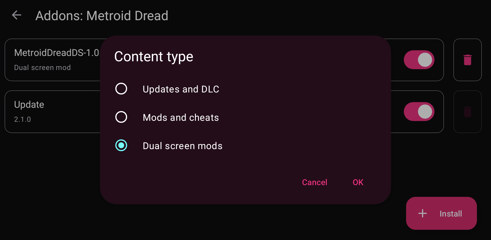

Installing a newer version of a companion replaces the older one.

---

## Persona 5 Royal

`01005CA01580E000` · game version 1.0.2 · companion 1.1.0

<!-- screenshots/persona5royal/*.png -->
| Field | Menu | Battle |
|:-----:|:----:|:------:|
| 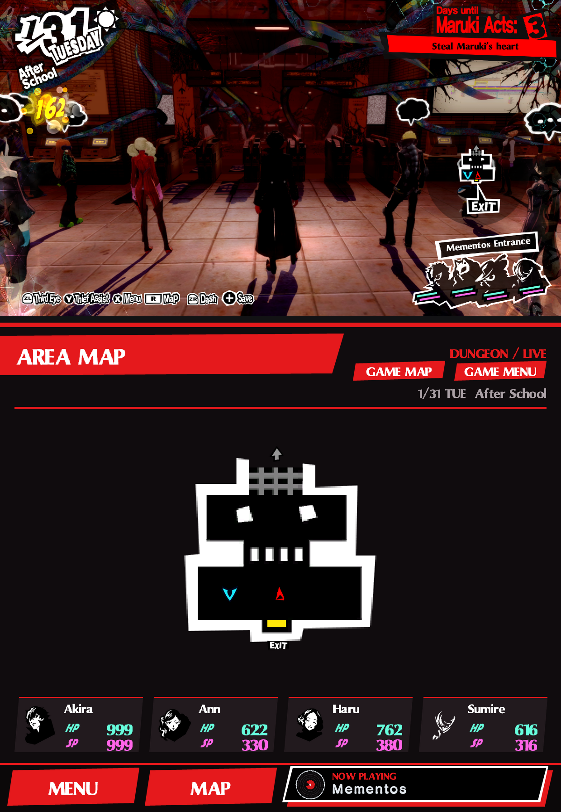 | 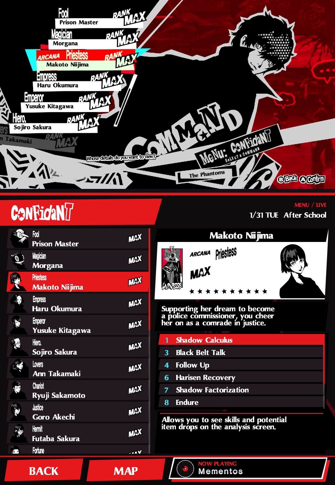 | 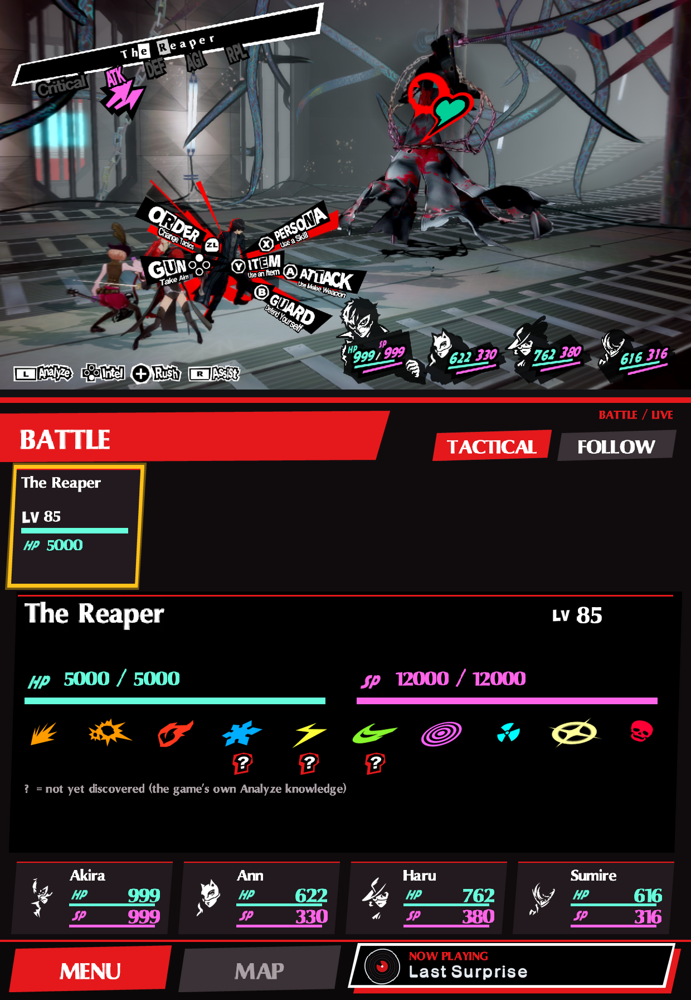 |

A full bottom-screen version of the game's own start menu, with live data:

- **Skill, Item, Equip, Persona, Stats, Confidant, Request, Calendar.** Laid out like the native camp menu.
  - Confidants show the character, arcana, rank and rank abilities.
  - Stats include baton pass and down shot.
- **Use items, change equipment and change Persona from the touch screen.** Changes apply instantly by writing the same values the game's own menu writes. Items and skills the game would refuse are greyed out. Anything that is not reproduced exactly, or any request made while the camp menu is already open, is carried out by driving the native menu with button presses.
- **Calendar.** Browse months with L/R and tap any day for its plans. Past days show the game's Daily Log.
- **Battle.** Choose TACTICAL (enemy grid, selected enemy's details and affinities as in Analyze, party status) or FOLLOW, a lighter view that follows the action.
- **Field.** Area map with your position, date, time of day and money.
- **Dialogue.** Only choices are shown, as large buttons; tapping one selects it.
- **Now playing.** The current background music with its title.

The companion ships no game art: menus, fonts and icons are drawn from your own game files when the page first opens.

## Metroid Dread

`010093801237C000` · game version 2.1.0 · companion 1.0.0

<!-- screenshots/metroid-dread/*.png -->
| Map | EMMI zone | Water drain |
|:---:|:---------:|:-----------:|
| 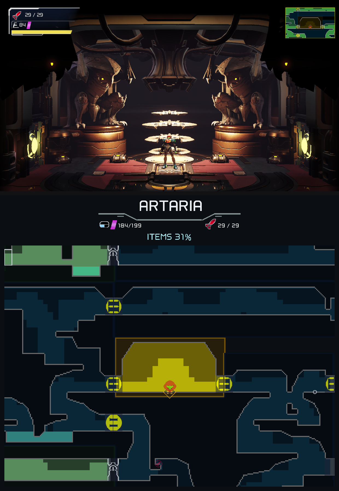 | 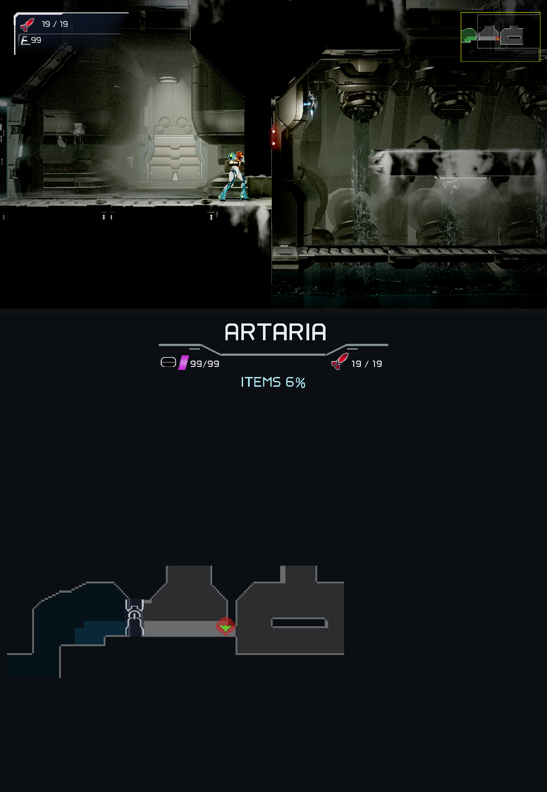 | 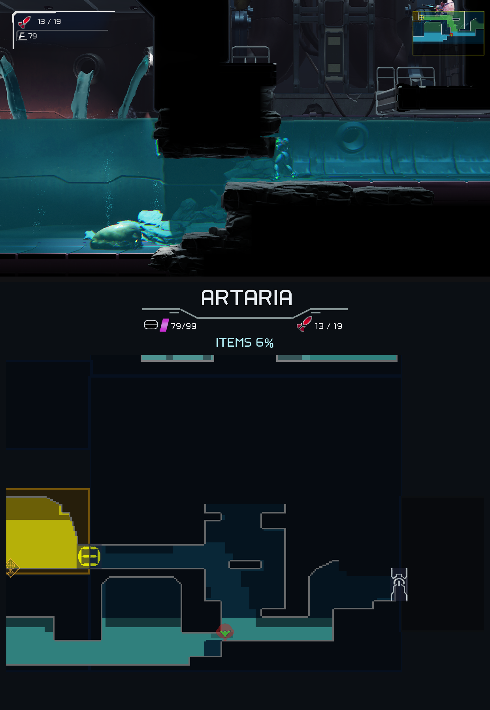 |

A live area map on the second screen, drawn the way the game draws its own:

- **Area map** with Samus's position, rooms revealed as you explore, doors, items and your custom markers.
- **EMMI zones**: grey while the EMMI is active and green once it has been destroyed, read from the game's own state.
- **Water** as the game's map shows it, including the level moving while a pool drains or fills.
- **Status**: energy and tanks, missiles, power bombs and item collection percentage.

The companion ships no game art: map geometry and icons are built from your own game files.

## The Legend of Zelda: Link's Awakening

`01006BB00C6F0000` · game version 1.0.1 · companion 1.0.0

<!-- screenshots/links-awakening/*.png -->
| Map | Gear | Items |
|:---:|:----:|:-----:|
| 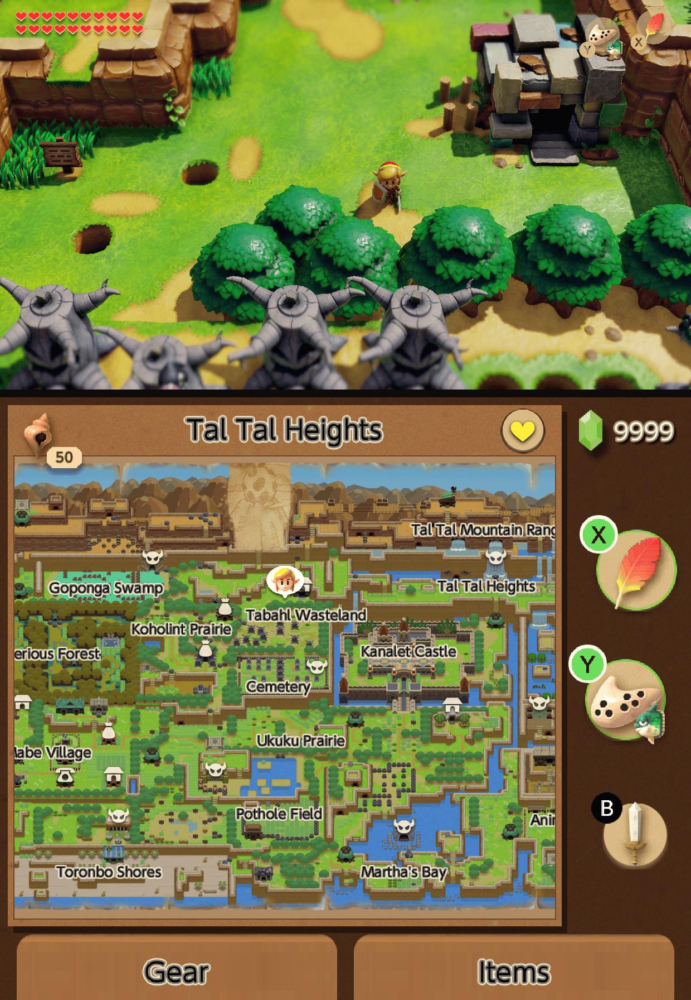 | 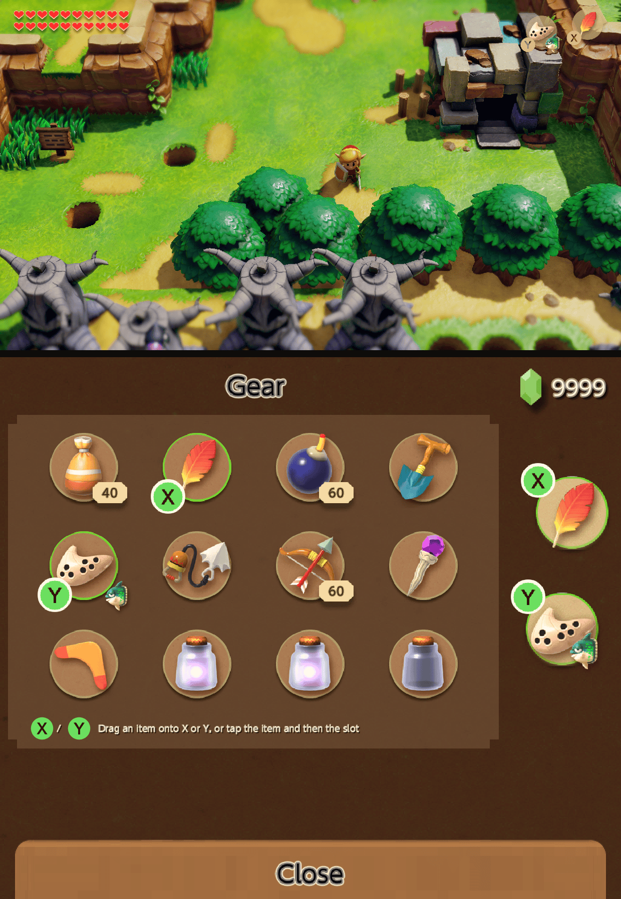 | 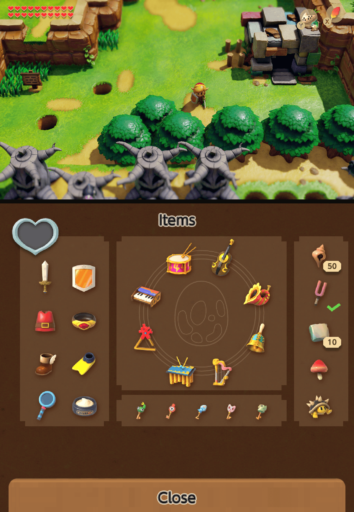 |

- **Map** of the overworld and dungeons with Link's live position, region names, rupees, seashells and what is on X, Y and B. Dungeon maps show rooms, chests, stairs and the boss room, and switch automatically when you enter a dungeon. Place, change and remove your own map pins.
- **Gear**: the items you can assign, such as magic powder, bombs, arrows, hookshot, rod, boomerang and bottles, with their counts. Equip to X or Y by dragging an item onto a slot, or by tapping the item and then the slot.
- **Items**: sword, shield, tunic, bracelet, boots, flippers and other equipment, the eight instruments, ocarina songs, trading item, heart pieces, secret seashells and secret stones.

The companion ships no game art: it uses your own game files.

## Mario Kart 8 Deluxe

`0100152000022000` · game version 4.0.0 or 3.0.3 (also with CTGP-DX v1.1.1) · companion 1.0.0

<!-- screenshots/mario-kart-8-deluxe/*.png -->
| Map | Horn | Next race |
|:---:|:----:|:---------:|
| 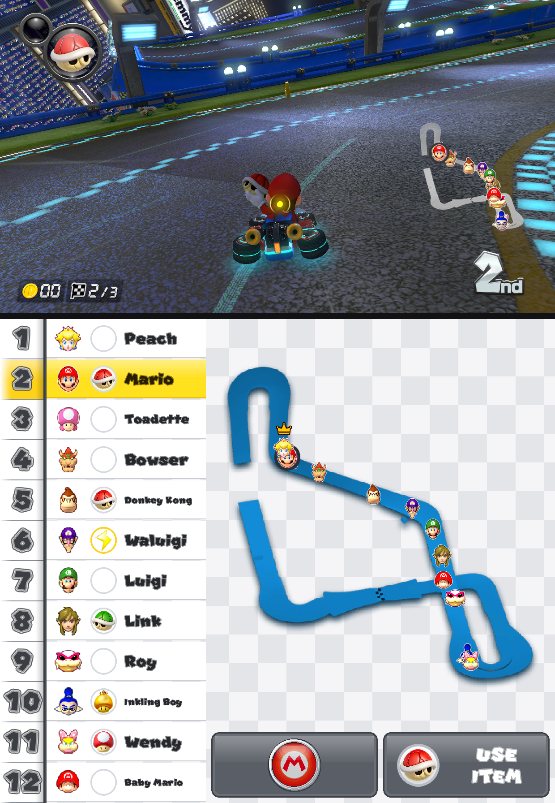 | 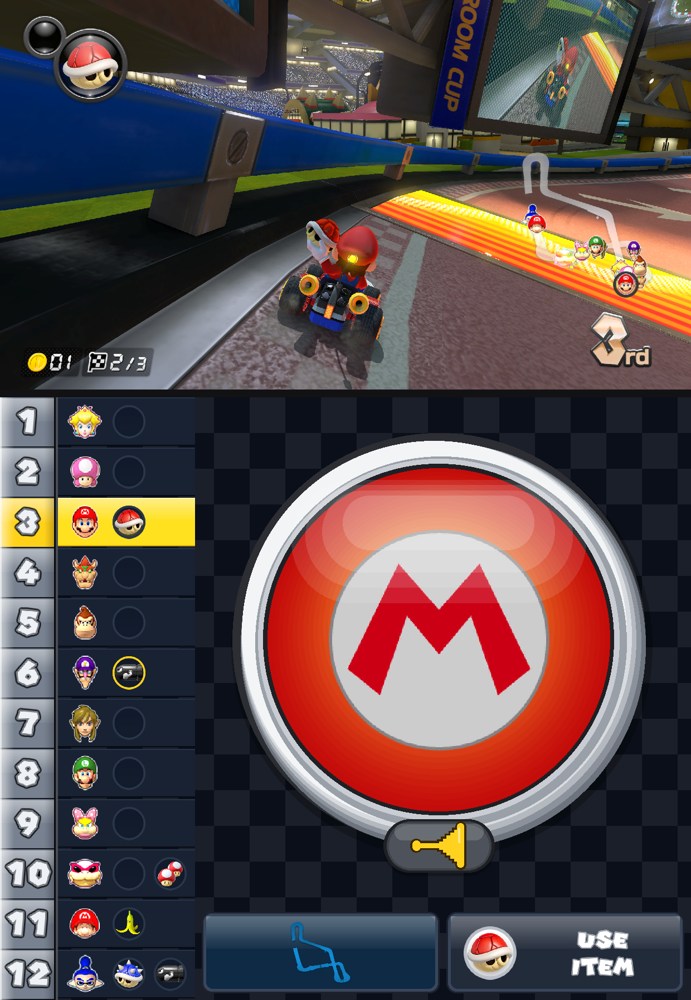 | 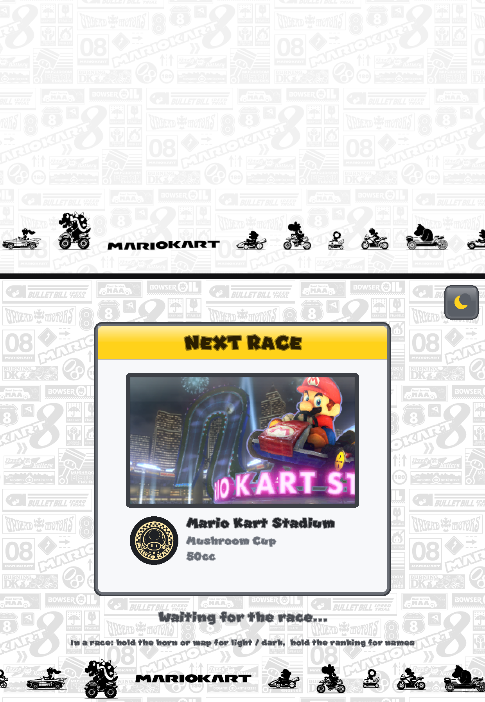 |

The race screen of the Wii U GamePad, on your second screen:

- **Rank bar.** A glass standings bar with all twelve racers in their live order and the items each one is holding right now. Your row is highlighted, finished racers get the checkered flag, and when racers overtake each other their cards slide into their new places.
- **Horn mode.** A big horn button with your kart's emblem. Tap it and your kart really honks.
- **Map mode.** The course map with every racer's live position, a crown on the leader and a ring around you. The companion starts in map mode.
- **Buttons.** **USE ITEM** fires your item. The other button switches between horn and map.
- **Two row formats and two themes.** Hold the rank bar to switch between short rows (icon and items) and long rows (with names). Hold the horn or the map to switch between the light and the dark theme. Both changes are animated, and taps and holds give haptic feedback.
- **Next race, loading and idle screens** on the game's own loading-screen art, with the course picture, cup and class.
- **CTGP-DX v1.1.1** on game version 3.0.3: custom tracks show their own maps, pictures and names. Install CTGP-DX in Eden Duo as a normal game mod (**Add-ons**, **Install**, **Mods**), next to the companion.
- **Other versions.** On an unsupported game version the companion shows which version it found and which ones it supports, and reads nothing.

The companion ships no game art: icons, maps, emblems, backgrounds, the font and all text are read from your own game files.

Limitations:

- One local player only. Local multiplayer (split screen) is not supported.
- Tested in Grand Prix races. VS races and Time Trials are untested.
- An item that is being used, such as an active Bullet Bill, is not shown in the rank bar.
- CTGP-DX is supported on game version 3.0.3 only, not on 4.0.0.

## Super Mario Bros. Wonder

`010015100B514000` · game version 1.2.1 · companion 1.0.1

<!-- screenshots/super-mario-bros-wonder/*.png -->
| Title | World map | Course |
|:-----:|:---------:|:------:|
| 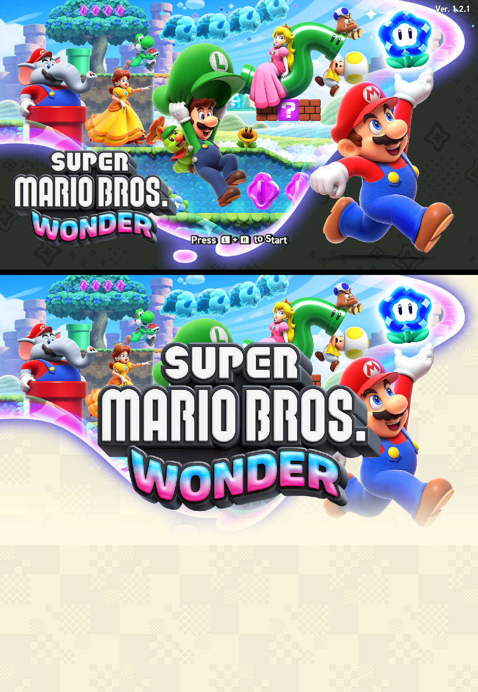 | 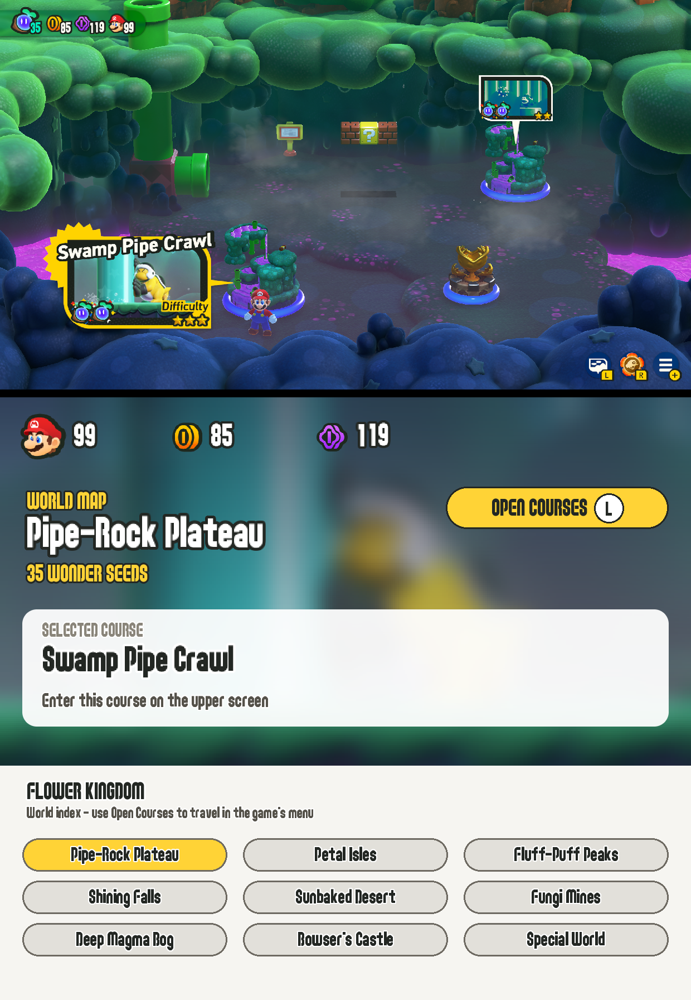 | 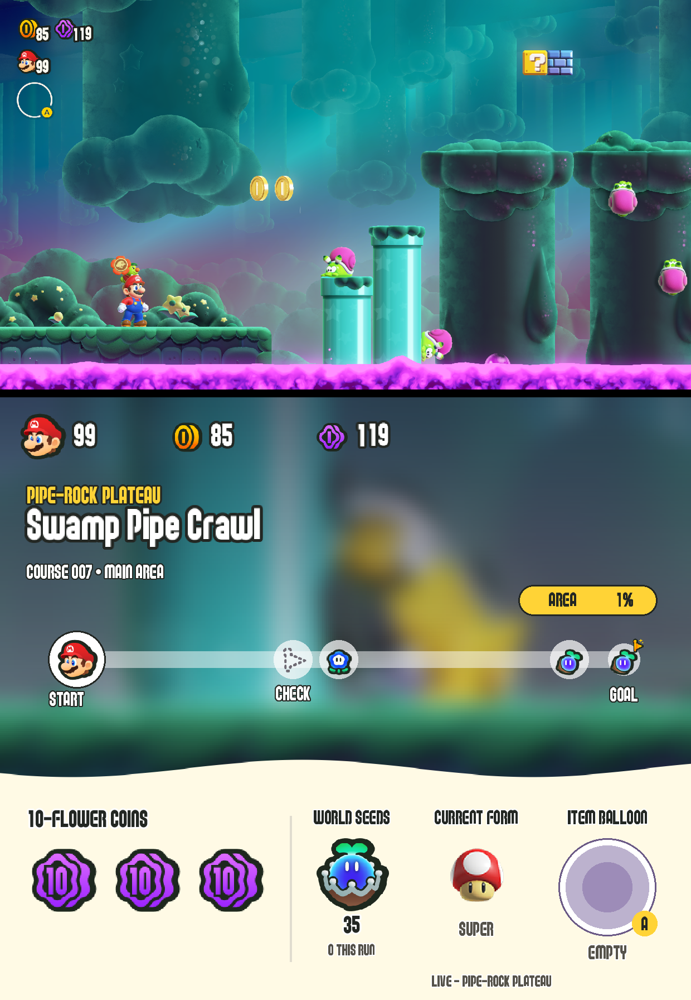 |

- **Course.** The world and course name over a blurred picture of the course, and a progress rail from start to goal with your character riding it. The rail marks checkpoints, 10-flower coins, Wonder Seeds and the secret goal as found or missing, and shows how far through the area you are.
- **Status.** The course's 10-flower coins, the world's Wonder Seeds (and how many this run), your current form and the item in your balloon.
- **World map.** The world's name and seeds, the selected course, all nine worlds, and an **Open Courses** button that opens the game's course list.
- **Title screen** art while you choose your save and character.
- Lives, coins and flower coins in the game's own lettering.
- **Other versions.** On any other game version the companion shows a notice and reads nothing.

The companion ships no game art: pictures, icons, the font and course names are read from your own game files.

---

## Building Packages

| Path | Contents |
|------|----------|
| [`packages/`](packages/) | Package sources, one folder per game: `dualscreen/manifest.json`, the per-build address table `<BUILDID>.json` (one per supported build) and, for Persona 5 Royal, the art recipe table `p5r_art.rec`. |
| [`tools/`](tools/) | `build_release.sh` builds the five `.dsmod.zip` archives. The page generators for Persona 5 Royal ([`tools/p5r/`](tools/p5r/)), Metroid Dread ([`tools/dread/`](tools/dread/)), Mario Kart 8 Deluxe ([`tools/mk8d/`](tools/mk8d/)) and Super Mario Bros. Wonder ([`tools/wonder/`](tools/wonder/)) are here too. |
| [`docs/`](docs/) | How the companion runtime works, the package format, writing a native module and porting a new game. |
| [`screenshots/`](screenshots/) | Captures of both screens for each game. |

The native modules for Persona 5 Royal, Metroid Dread, Mario Kart 8 Deluxe and Super Mario Bros. Wonder are C++ and live in the Eden Duo repository under [`src/core/mods/modules`](https://github.com/igawa6/eden-duo/tree/main/src/core/mods/modules). Build them there, strip them, and pass them to the release script:

```sh
P5R_LINUX_SO=... P5R_ANDROID_SO=... DREAD_LINUX_SO=... DREAD_ANDROID_SO=... \
MK8D_LINUX_SO=... MK8D_ANDROID_SO=... WONDER_LINUX_SO=... WONDER_ANDROID_SO=... \
tools/build_release.sh dist
```

See [`tools/README.md`](tools/README.md) for the details. Link's Awakening needs no native module.

## Reporting Problems

Open an issue and include:

- the game, its version and its title ID;
- the companion version (in **Add-ons**);
- the Eden Duo version;
- the device.

A screenshot of both screens helps.

## Game Assets

Companion packages contain **no game assets**: no art, text, audio or level data. Everything game-specific that a companion shows is read at runtime from the player's own game files and from the running game. Do not upload game files, keys, firmware or ROMs to this repository.

## AI Assistance

These companions were developed with AI assistance. The companion modules, the reverse engineering of each game's data and the package generators were written with an AI coding assistant (Claude, by Anthropic), then reviewed, tested and verified against each game's own screens.

## License

Companion packages and tools are free software, released under the [GNU General Public License v3.0](LICENSE). They are not affiliated with or endorsed by Nintendo, Atlus, SEGA, the CTGP-DX team, or the Eden project. All trademarks belong to their respective owners.
